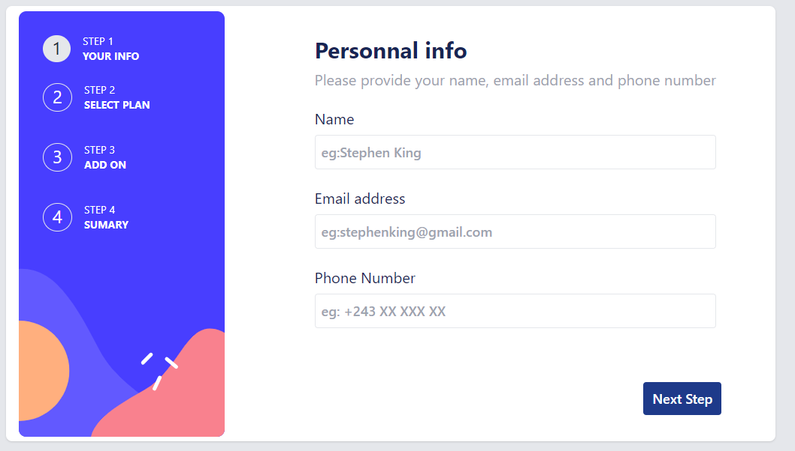

# Frontend Mentor - Multi-step form solution

This is a solution to the [Multi-step form challenge on Frontend Mentor](https://www.frontendmentor.io/challenges/multistep-form-YVAnSdqQBJ). Frontend Mentor challenges help you improve your coding skills by building realistic projects. 

## Table of contents

- [Overview](#overview)
  - [The challenge](#the-challenge)
  - [Screenshot](#screenshot)
  - [Links](#links)
- [My process](#my-process)
  - [Built with](#built-with)
  - [What I learned](#what-i-learned)
  - [Continued development](#continued-development)
  - [Useful resources](#useful-resources)
- [Author](#author)
- [Acknowledgments](#acknowledgments)

## Overview

### The challenge

Users should be able to:

- Complete each step of the sequence
- Go back to a previous step to update their selections
- See a summary of their selections on the final step and confirm their order
- View the optimal layout for the interface depending on their device's screen size
- See hover and focus states for all interactive elements on the page
- Receive form validation messages if:
  - A field has been missed
  - The email address is not formatted correctly
  - A step is submitted, but no selection has been made

### Screenshot

**Note: Delete this note and the paragraphs above when you add your screenshot. If you prefer not to add a screenshot, feel free to remove this entire section.**

### Links

- Solution URL: [Add solution URL here](https://your-solution-url.com)
- Live Site URL: [Add live site URL here](https://your-live-site-url.com)

## My process

### Built with

- TailWindCss
- CSS custom properties
- Flexbox
- CSS Grid
- Mobile-first workflow
- [React](https://reactjs.dev/) - JS library
- [NextUi](https://nextui.org) - For some Components

### What I learned

Use of multistep configuration

### Continued development

I would like to improve the performance of the code and the use of components and libraries

### Useful resources

- [NextUi](https://nextui.org/) - This Library helped me to make some component like Switch and card
- [Tailwind Css](https://tailwindcss.com/) - This is an amazing css framework that helps me to develops quickly and optimize css codes 

## Author

- Website - [Daniel Assani](https://github.com/asddaniel)
- Frontend Mentor - [@asddaniel](https://www.frontendmentor.io/profile/asddaniel)
- Linkedin - [Daniel Assani](https://www.linkedin.com/in/daniel-assani-8a9394217)

## Acknowledgments

